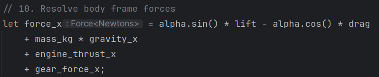

# absolute_unit

A unit system for Rust's type system to catch unit errors at build time.

## Examples

Use the type system to ensure that you get the expected units out of a calculation.
```rust
let time = seconds!(10);
let velocity = meters_per_second!(100);
let position: Length<Meters> = velocity * time;
assert_eq!(position, meters!(100));
```

Use IDE type introspection to discover the type of a result.


Check type correctness even when using approximation formulas that contain intermediate values with no inherent
unit-based meaning. Runtime checks only happen in `#[cfg(debug_assertions)]`, so there is no runtime cost in
release builds.
```rust
let drag: Force<Newtons> = (coef_drag.as_dyn()
            * air_density.as_dyn()
            * (velocity_cg * velocity_cg).as_dyn()
            * meters2!(1_f64).as_dyn())
        .into();
```

## Technical Details

The unit wrappers store the underlying value as f64. Values are wrapped in OrderedFloat and the unit values provide
the same derivations as the underlying OrderedFloat(f64), enabling straightforward usage in most situations. All of
the type info compiles away, leaving identical performance to bare f64.

## Usage

Add absolute_unit to your Cargo.toml:
```toml
absolute_unit = "0.9"
```

Import the prelude to get access to everything, or import ala carte, if you know what you need.
```rust
use absolute_unit::prelude::*;
```